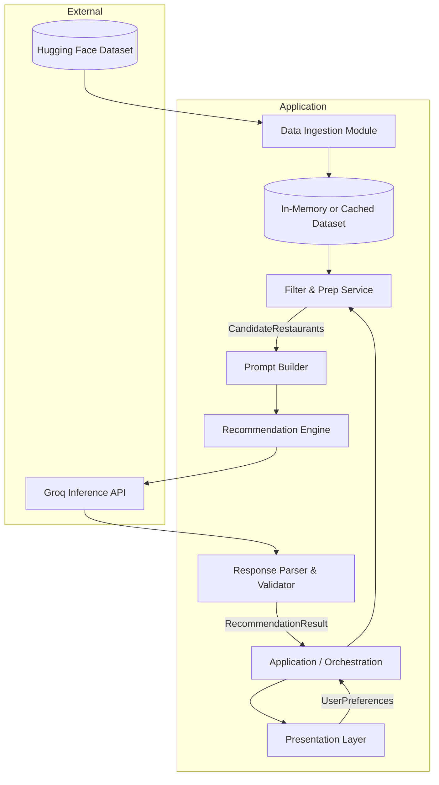
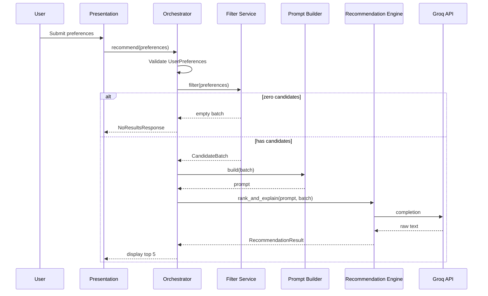
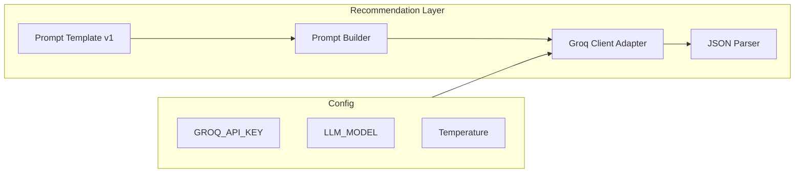
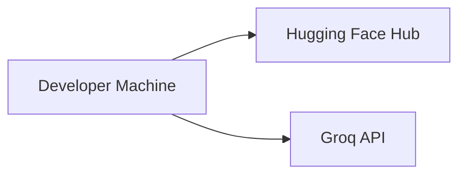

# System Architecture: AI-Powered Restaurant Recommendation System

This document defines the technical architecture for the Zomato-inspired recommendation service described in [`docs/context.md`](context.md). It translates product requirements into implementable layers, components, data contracts, and integration patterns.

**Related documents**

| Document | Role |
|----------|------|
| [`docs/context.md`](context.md) | Product context, workflow, success criteria |
| [`docs/problemStatement.txt`](problemStatement.txt) | Original problem statement |

---

## 1. Architecture Goals

| Goal | How architecture supports it |
|------|------------------------------|
| **Structured + LLM hybrid** | Hard filters on dataset first; LLM only sees a bounded candidate set |
| **Personalization** | User preference object drives filter rules and LLM prompt context |
| **Transparency** | Each result carries structured fields plus an LLM-generated explanation |
| **Usability** | Presentation layer renders a fixed, scannable result schema |
| **Trust** | Candidates must satisfy explicit constraints before ranking |

**Default product constraint (from project name):** return **top 5** recommendations unless configured otherwise.

---

## 2. High-Level System View

The system is a **pipeline-oriented application** with five logical stages matching the workflow in `context.md`. There is no requirement for microservices; a modular monolith or layered single process is sufficient for the initial build.



### 2.1 Architectural style

| Aspect | Choice | Rationale |
|--------|--------|-----------|
| **Pattern** | Layered pipeline + orchestrator | Maps 1:1 to the five workflow stages |
| **Deployment** | Single deployable unit (CLI, web app, or API) | No auth/persistence required in v1 |
| **State** | Stateless per request (dataset loaded at startup or on demand) | Simplifies scaling and testing |
| **LLM role** | Ranking, explanation, optional summary only | Keeps cost and latency bounded |

---

## 3. Layered Architecture

```
┌────────────────────────────────────────────────────────────────────────────┐
│                     PRESENTATION LAYER                                      │
│  Forms / CLI prompts · Result cards · Error messages · Loading states       │
└────────────────────────────────────────────────────────────────────────────┘
                                      │
                                      ▼
┌────────────────────────────────────────────────────────────────────────────┐
│                     APPLICATION / ORCHESTRATION LAYER                       │
│  Request lifecycle · Validate input · Coordinate pipeline · Map errors      │
└────────────────────────────────────────────────────────────────────────────┘
                                      │
          ┌───────────────────────────┼───────────────────────────┐
          ▼                           ▼                           ▼
┌──────────────────┐    ┌──────────────────────┐    ┌──────────────────────────┐
│  DATA LAYER      │    │  INTEGRATION LAYER    │    │  RECOMMENDATION LAYER     │
│  Ingestion       │    │  Filter & Prep        │    │  Prompt · LLM · Parse     │
│  Normalize       │    │  Candidate selection  │    │  Rank · Explain · Summary │
│  Cache / Index   │    │  Token budget trim    │    │                           │
└──────────────────┘    └──────────────────────┘    └──────────────────────────┘
                                      │
                                      ▼
                          ┌──────────────────────┐
                          │  EXTERNAL SERVICES    │
                          │  Hugging Face · LLM   │
                          └──────────────────────┘
```

---

## 4. Component Design

### 4.1 Data Ingestion Module

**Responsibility:** Load, clean, and normalize the Hugging Face dataset into an internal restaurant model.

| Concern | Design |
|---------|--------|
| **Source** | `ManikaSaini/zomato-restaurant-recommendation` via `datasets` library or equivalent |
| **When** | Application startup (eager) or first request (lazy with cache) |
| **Output** | Normalized collection of `Restaurant` records |
| **Failure** | Fail fast with clear error if dataset unreachable; optional retry with backoff |

**Processing steps**

1. Download / load dataset split(s)
2. Map raw columns → canonical field names
3. Parse and validate types (rating as float, cost as numeric or bucket)
4. Drop or impute rows with missing critical fields (name, location)
5. Normalize strings (trim, case-fold location/cuisine for matching)
6. Derive **budget bucket** (`low` | `medium` | `high`) from cost if not present in source
7. Store in memory (DataFrame, list of dicts, or lightweight DB for larger scale)

**Suggested canonical model**

```text
Restaurant
├── id: string              # stable row id from dataset or generated UUID
├── name: string
├── location: string        # city / area (normalized)
├── cuisines: list[string]  # one or many cuisine tags
├── rating: float           # e.g. 0.0–5.0
├── cost: number | null     # estimated cost for two, or similar
├── budget_tier: enum       # low | medium | high (derived or sourced)
└── metadata: object        # optional raw fields for future use
```

---

### 4.2 User Input / Presentation Layer

**Responsibility:** Collect preferences and render final recommendations.

**Input contract: `UserPreferences`**

| Field | Type | Required | Notes |
|-------|------|----------|-------|
| `location` | string | yes | **Area/locality preferred** (e.g. Indiranagar, Bellandur). City names (e.g. Bangalore, Delhi) are also supported via `metadata.listed_city` matching. |
| `budget` | enum | yes | `low` \| `medium` \| `high` |
| `cuisine` | string | yes | e.g. Italian, Chinese; partial match on tags |
| `min_rating` | float | yes | Inclusive lower bound |
| `additional_preferences` | string | no | free text: family-friendly, quick service, etc. |
| `top_n` | int | no | default **5** |

**UI options (open in context; architecture supports any)**

| Option | Fit |
|--------|-----|
| **Streamlit / Gradio** | Fastest path to demo with forms and cards |
| **CLI** | Scriptable, good for tests and CI |
| **REST API + SPA** | Production-style separation |

Presentation renders each recommendation as:

```text
RecommendationCard
├── rank: int
├── name, cuisine, rating, estimated_cost  # from structured data
├── explanation: string                       # from LLM
└── optional summary: string                  # session-level, once per response
```

#### 4.2.1 Python imports & Streamlit entry (fix `ModuleNotFoundError: app`)

`streamlit run app/presentation/ui.py` does **not** automatically add the **repository root** to `sys.path`. If the root is missing, imports such as `from app.ingestion.loader import ...` fail with:

```text
ModuleNotFoundError: No module named 'app'
```

| Requirement | Design |
|-------------|--------|
| **Repo root on path** | The directory that contains `app/` and `config/` must be importable (e.g. `d:\Zomato-Top 5`) |
| **Package layout** | `app/` is a Python package (`app/__init__.py`); same for `config/` |
| **Streamlit bootstrap** | At the top of `app/presentation/ui.py`, prepend repo root to `sys.path` **before** any `from app...` or `from config...` imports |
| **Recommended run** | Always start Streamlit from the repo root; set `PYTHONPATH=.` (Windows: `$env:PYTHONPATH="."`) |
| **CLI / tests** | `python -m app.main` and `pytest` use root via `pythonpath = .` in `pytest.ini` |

**Bootstrap pattern (required in `ui.py`):**

```python
import sys
from pathlib import Path

_PROJECT_ROOT = Path(__file__).resolve().parents[2]  # repo root (parent of app/)
if str(_PROJECT_ROOT) not in sys.path:
    sys.path.insert(0, str(_PROJECT_ROOT))

from app.ingestion.loader import DatasetLoadError, load_restaurants  # noqa: E402
```

**Do not** run Streamlit from inside `app/presentation/` without setting `PYTHONPATH` to the repo root.

---

### 4.3 Filter & Prep Service (Integration Layer)

**Responsibility:** Reduce the full dataset to a **bounded candidate list** that satisfies hard constraints before any LLM call.

**Filter pipeline (order matters for performance)**

```
ALL RESTAURANTS
    → location match (normalized contains / equality)
    → cuisine match (tag overlap or substring)
    → min_rating >= threshold
    → budget_tier match (or cost range mapping)
    → sort by rating desc (pre-rank signal)
    → cap at MAX_CANDIDATES (e.g. 20–50)
```

| Parameter | Recommended value | Purpose |
|-----------|-------------------|---------|
| `MAX_CANDIDATES` | 30 | Limits LLM tokens and latency |
| `MIN_CANDIDATES` | 1 | If 0 after filter, return user-facing “no matches” without LLM |
| `FALLBACK_RELAXATION` | optional | If 0 matches, relax cuisine or budget one step (document in UX) |

**Output contract: `CandidateBatch`**

```text
CandidateBatch
├── preferences: UserPreferences
├── candidates: list[Restaurant]   # size ≤ MAX_CANDIDATES
├── filter_stats: object           # total before/after, relaxed rules if any
└── serialized_for_prompt: string  # compact JSON or table for LLM
```

**Design rule:** The LLM must never receive the entire raw dataset—only `CandidateBatch`.

---

### 4.4 Prompt Builder

**Responsibility:** Construct a deterministic, versioned prompt from `UserPreferences` and `CandidateBatch`.

**Prompt structure (sections)**

1. **System role** — Expert dining recommender; use only provided restaurants; no hallucinated venues
2. **User preferences** — Structured summary of location, budget, cuisine, min rating, extras
3. **Candidate list** — JSON array or markdown table with id, name, location, cuisines, rating, cost
4. **Task instructions** — Rank top N; explain each; optional one-paragraph summary
5. **Output format** — Strict JSON schema (see §6)

**Versioning:** Store prompt templates as `prompts/v1_rank_and_explain.txt` (or equivalent) for reproducibility and A/B tests.

---

### 4.5 Recommendation Engine (LLM)

**Responsibility:** Call the LLM, enforce output shape, merge LLM output with structured restaurant data.

| Concern | Design |
|---------|--------|
| **Provider** | **Groq** (default for v1 / Phase 3) via `groq` Python SDK; adapter remains config-driven for future providers |
| **Temperature** | Low (0.2–0.4) for stable ranking |
| **Max tokens** | Sized for top 5 × explanation + summary |
| **Retries** | 1–2 retries on malformed JSON |
| **Fallback** | If LLM fails, return filter order top N with template explanations |

**Engine steps**

1. Build prompt via Prompt Builder
2. Invoke LLM with JSON-mode or schema instruction where supported
3. Parse response → `LLMRecommendationPayload`
4. Validate restaurant ids exist in `CandidateBatch`
5. Hydrate final `RecommendationResult` with canonical fields from dataset
6. Truncate to `top_n` (default 5)

---

### 4.6 Response Parser & Validator

**Responsibility:** Guarantee the application never surfaces invalid or invented restaurants.

| Validation | Action |
|------------|--------|
| JSON parseable | Retry or fallback |
| Each `restaurant_id` in candidate set | Drop invalid entries or fail request |
| Rank unique and 1..N | Re-sort if needed |
| Required fields present | Fill from dataset if LLM omitted structured fields |
| Explanation non-empty | Optional default template |

---

### 4.7 Application Orchestrator

**Responsibility:** Single entry point for one recommendation request.



---

## 5. Data Flow (End-to-End)

```
[Hugging Face] 
      │ load & normalize
      ▼
[Restaurant Store] ─────────────────────────────────────┐
      │                                                    │
      │                              UserPreferences       │
      ▼                                                    ▼
[Filter Service] ──► [CandidateBatch] ──► [Prompt Builder] ──► [LLM]
                                                      │
                                                      ▼
                                            [Parser / Validator]
                                                      │
                                                      ▼
                                            [RecommendationResult]
                                                      │
                                                      ▼
                                            [Presentation Layer]
```

---

## 6. API & Data Contracts

### 6.1 Internal service interface (conceptual)

```text
recommend(preferences: UserPreferences) -> RecommendationResult | NoResultsResponse

filter(preferences: UserPreferences) -> CandidateBatch

build_prompt(batch: CandidateBatch) -> string

invoke_llm(prompt: string) -> LLMRecommendationPayload
```

### 6.2 LLM output schema (recommended)

```json
{
  "summary": "Optional one-paragraph overview of the selection",
  "recommendations": [
    {
      "restaurant_id": "string",
      "rank": 1,
      "explanation": "Why this fits the user's location, budget, cuisine, and extras"
    }
  ]
}
```

### 6.3 Final API response schema

```json
{
  "summary": "string | null",
  "preferences": { "location": "...", "budget": "...", "cuisine": "...", "min_rating": 4.0 },
  "recommendations": [
    {
      "rank": 1,
      "restaurant_id": "...",
      "name": "Restaurant Name",
      "cuisine": "Italian",
      "rating": 4.5,
      "estimated_cost": "₹800 for two",
      "explanation": "AI-generated reason"
    }
  ],
  "meta": {
    "candidates_considered": 28,
    "top_n": 5
  }
}
```

---

## 7. Budget & Location Matching Logic

Architecture assumes explicit, testable rules in the Filter Service (not left to the LLM).

| User budget | Typical rule |
|-------------|--------------|
| `low` | `budget_tier == low` OR cost ≤ low_threshold |
| `medium` | `budget_tier == medium` OR cost in (low_threshold, high_threshold] |
| `high` | `budget_tier == high` OR cost > high_threshold |

Thresholds are **configuration**, calibrated once from dataset percentiles during ingestion.

| User location | Typical rule |
|---------------|--------------|
| City name | Normalized case-insensitive match on `location` field |
| Partial | `location.contains(user.location)` or synonym map (e.g. Bengaluru → Bangalore) |

---

## 8. LLM Integration Architecture

**v1 / Phase 3 provider:** [Groq](https://console.groq.com/) Inference API. The recommendation client calls Groq chat completions (not OpenAI). CI and local dev use a mock adapter when `GROQ_API_KEY` is unset.



| Groq integration | Detail |
|------------------|--------|
| **SDK** | `groq` (`pip install groq`) |
| **Auth** | `GROQ_API_KEY` environment variable |
| **Default model** | `llama-3.3-70b-versatile` (override via `LLM_MODEL`) |
| **Config** | `LLM_PROVIDER=groq` selects the Groq adapter in `app/llm/client.py` |

| Adapter method | Purpose |
|----------------|---------|
| `complete(prompt, options)` | Groq chat completion wrapper |
| `complete_json(prompt, schema)` | JSON-oriented completion; use `response_format` / schema instructions when the model supports it, else strict prompt + parser retry |

**Cost control**

- Cap candidates before prompt (§4.3)
- Use compact serialization (ids + key fields only)
- Cache dataset in memory to avoid repeated HF downloads

**Safety**

- System prompt: only recommend from supplied list
- Post-validate every id against `CandidateBatch`

---

## 9. Cross-Cutting Concerns

### 9.1 Configuration

| Key | Example | Layer |
|-----|---------|-------|
| `HF_DATASET_ID` | ManikaSaini/zomato-restaurant-recommendation | Ingestion |
| `LLM_PROVIDER` | groq | Recommendation |
| `LLM_MODEL` | llama-3.3-70b-versatile | Recommendation |
| `GROQ_API_KEY` | (secret) | Recommendation |
| `MAX_CANDIDATES` | 30 | Filter |
| `DEFAULT_TOP_N` | 5 | Orchestrator |
| `BUDGET_THRESHOLDS` | JSON percentiles | Ingestion |

Load from environment variables or `.env` (never commit secrets).

### 9.2 Error handling

| Scenario | User-facing behavior | System behavior |
|----------|----------------------|-----------------|
| Dataset load failure | “Unable to load restaurant data” | Log error; exit or degraded mode |
| No filter matches | “No restaurants match; try relaxing filters” | Skip LLM |
| LLM timeout / error | Show filter-based top 5 + generic explanation | Log; metric |
| Invalid LLM JSON | Retry once, then fallback | Log prompt hash |

### 9.3 Logging & observability

- Log filter counts (before/after), latency per stage, LLM token usage
- Do not log full API keys or raw user PII beyond preferences needed for debug

### 9.4 Testing strategy

| Layer | Test type |
|-------|-----------|
| Ingestion | Unit: normalization, budget derivation |
| Filter | Unit: each rule + edge cases (zero results) |
| Prompt | Snapshot: stable prompt for fixed input |
| Parser | Unit: valid/invalid JSON, unknown ids |
| E2E | Mock LLM; assert response schema and top 5 count |

---

## 10. Suggested Physical Layout (Reference Implementation)

Stack-agnostic module layout aligned with layers above:

```text
zomato-top-5/                   # PYTHONPATH / cwd for Streamlit & CLI
├── app/
│   ├── __init__.py
│   ├── main.py                 # entry (CLI)
│   ├── orchestrator.py         # recommend() lifecycle
│   ├── models.py               # Restaurant, UserPreferences, DTOs
│   ├── ingestion/
│   │   ├── loader.py           # Hugging Face load
│   │   └── normalize.py
│   ├── filtering/
│   │   └── filter_service.py
│   ├── llm/
│   │   ├── prompt_builder.py
│   │   ├── client.py           # provider adapter
│   │   └── parser.py
│   └── presentation/
│       ├── __init__.py
│       └── ui.py               # Streamlit entry (sys.path bootstrap)
├── prompts/
│   └── v1_rank_and_explain.txt
├── config/
│   ├── __init__.py
│   └── settings.py
├── pytest.ini                  # pythonpath = .
├── tests/
├── docs/
│   ├── context.md
│   └── architecture.md
├── requirements.txt
└── .env.example
```

---

## 11. Deployment Views

### 11.1 Local development



- Dataset cached after first download
- API keys in local `.env`

**Run Streamlit UI (from repo root):**

```bash
# macOS / Linux
cd zomato-top-5
export PYTHONPATH=.
streamlit run app/presentation/ui.py
```

```powershell
# Windows (PowerShell)
cd "d:\Zomato-Top 5"
$env:PYTHONPATH="."
.\.venv\Scripts\streamlit.exe run app\presentation\ui.py
```

Sanity check before starting UI:

```bash
python -c "import app; print('ok')"
```

### 11.2 Optional hosted deployment

| Target | Components |
|--------|------------|
| **Streamlit Cloud / Render** | Single container: app + cached dataset |
| **Docker** | Image with pre-warmed dataset optional |
| **Serverless** | Not ideal for large in-memory dataset unless externalized store |

No authentication or user database required for v1 per `context.md`.

---

## 12. Non-Functional Requirements

| NFR | Target (initial) |
|-----|------------------|
| **Latency** | &lt; 10s end-to-end (dominated by LLM) |
| **Availability** | Best-effort; depends on HF + LLM SLA |
| **Scalability** | Vertical; in-memory dataset sufficient for demo dataset size |
| **Maintainability** | Clear stage boundaries; swappable LLM adapter |
| **Explainability** | Per-item LLM explanation + optional summary |

---

## 13. Security & Privacy

| Topic | Approach |
|-------|----------|
| **Secrets** | `GROQ_API_KEY` (and other LLM keys) via environment only |
| **Data** | Public dataset; no user accounts in v1 |
| **Input** | Sanitize free-text `additional_preferences` before prompt injection |
| **Output** | No execution of LLM content as code |

---

## 14. Future Extensions (Out of v1 Scope)

Architecture allows these without redesign:

- Persistent user profiles and history
- Vector search for semantic cuisine / vibe matching before LLM
- A/B testing of prompt versions
- REST API behind mobile app
- Feedback loop (thumbs up/down) to tune ranking
- Multi-city batch recommendations

---

## 15. Traceability to Context

| `context.md` section | Architecture section |
|--------------------|----------------------|
| Stage 1: Data Ingestion | §4.1, §5 |
| Stage 2: User Input | §4.2, §6 |
| Stage 3: Integration Layer | §4.3, §4.4, §7 |
| Stage 4: Recommendation Engine | §4.5, §8 |
| Stage 5: Output Display | §4.2, §6.3 |
| Design: Structured + LLM | §2, §4.3, §4.5 |
| Success criteria | §4.6, §9.4, §6.3 |
| Top 5 (project name) | §1, §4.2, §6 |

---

## 16. Architecture Decision Records (Summary)

| ID | Decision | Rationale |
|----|----------|-----------|
| ADR-001 | Filter before LLM | Cost, latency, hallucination control |
| ADR-002 | Default top 5 results | Matches project name and UX clarity |
| ADR-003 | JSON LLM output + validation | Reliable parsing and id binding |
| ADR-004 | In-memory dataset v1 | Simplicity; dataset size manageable for HF demo |
| ADR-005 | Modular monolith | No distributed complexity required by spec |
| ADR-006 | Groq for Phase 3 LLM | Fast inference, simple SDK, suitable for ranking + explanation JSON |
| ADR-007 | Repo root on `sys.path` for Streamlit | Prevents `ModuleNotFoundError: app` when running `ui.py` |

---

**Document version:** 1.0  
**Derived from:** [`docs/context.md`](context.md)
