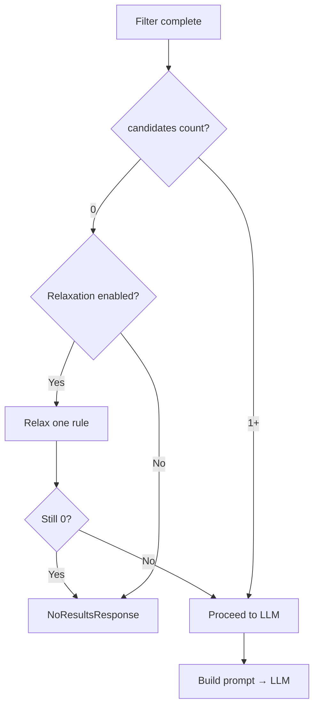
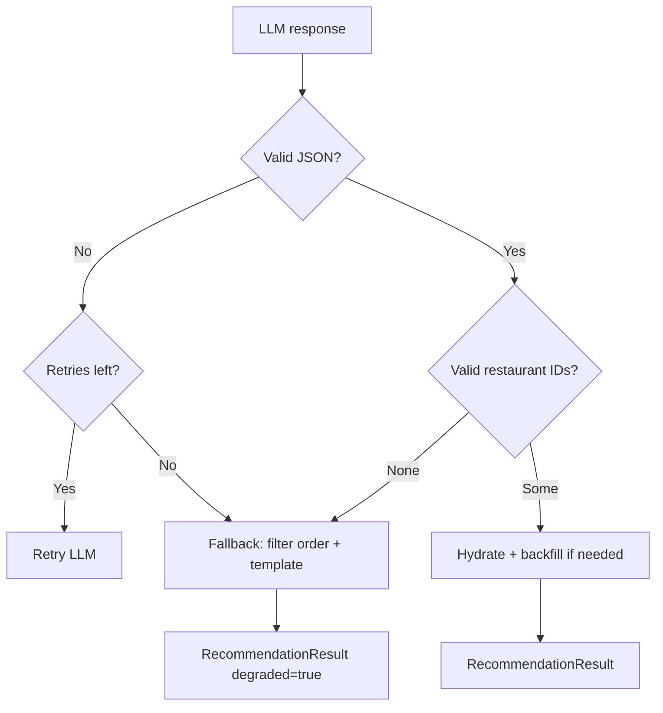

# Edge Cases & Exception Handling Guide

This document catalogs **known edge cases** for the AI-powered restaurant recommendation system. Each entry defines detection, expected system behavior, user-facing messaging, and test guidance.

**Related documents**

| Document | Role |
|----------|------|
| [`docs/context.md`](context.md) | Product requirements and success criteria |
| [`docs/architecture.md`](architecture.md) | Components, contracts, error-handling §9.2 |
| [`docs/implementation-plan.md`](implementation-plan.md) | Phase where each case should be implemented |

**Severity legend**

| Level | Meaning |
|-------|---------|
| **P0** | Must handle before release; data integrity or security risk |
| **P1** | Should handle in v1; degrades UX or trust if ignored |
| **P2** | Nice to have; document and handle in hardening or v2 |

**Handling types**

| Code | Meaning |
|------|---------|
| **REJECT** | Return validation error; do not proceed |
| **SKIP** | Omit invalid item; continue pipeline |
| **FALLBACK** | Use alternate logic (relax filter, template text, rating order) |
| **FAIL** | Stop request; show safe error (no stack trace to user) |
| **DEGRADE** | Partial results with warning |

---

## Quick Reference Matrix

| Category | Count | Primary layer |
|----------|-------|---------------|
| [§1 Data ingestion](#1-data-ingestion-edge-cases) | EC-D01–D20 | Ingestion |
| [§2 User input](#2-user-input-edge-cases) | EC-U01–U25 | Presentation / Orchestrator |
| [§3 Filtering](#3-filtering-edge-cases) | EC-F01–F22 | Filter service |
| [§4 Prompt & LLM](#4-prompt--llm-edge-cases) | EC-L01–L24 | LLM layer |
| [§5 Parser & validation](#5-parser--validation-edge-cases) | EC-P01–P18 | Parser |
| [§6 Orchestrator & pipeline](#6-orchestrator--pipeline-edge-cases) | EC-O01–O12 | Orchestrator |
| [§7 Presentation & output](#7-presentation--output-edge-cases) | EC-V01–V14 | UI |
| [§8 External services](#8-external-services-edge-cases) | EC-X01–X12 | Cross-cutting |
| [§9 Security](#9-security-edge-cases) | EC-S01–S10 | Cross-cutting |
| [§10 Config & environment](#10-configuration--environment-edge-cases) | EC-C01–C08 | Config |

---

## 1. Data Ingestion Edge Cases

| ID | Edge case | Detection | Handling | User / system message | Test |
|----|-----------|-----------|----------|----------------------|------|
| **EC-D01** | Hugging Face unreachable (network, 503) | `ConnectionError`, timeout on load | **FAIL** at startup; retry 3× with exponential backoff | "Unable to load restaurant data. Check your connection and try again." | Mock `datasets.load` to raise |
| **EC-D02** | Dataset ID wrong or removed | `DatasetNotFoundError` | **FAIL** at startup | "Restaurant dataset not found." | Invalid `HF_DATASET_ID` |
| **EC-D03** | Empty dataset after load | `len(rows) == 0` | **FAIL** at startup | "Restaurant dataset is empty." | Empty mock DataFrame |
| **EC-D04** | Unexpected column schema | Missing expected columns after mapping | **FALLBACK** map via alias table; log warning; **FAIL** if no name/location column | Log: `Unknown schema, using fallback mapping` | Fixture with renamed columns |
| **EC-D05** | Missing `name` or `location` | Null/empty critical fields | **SKIP** row; increment `dropped_rows` stat | N/A (silent) | Row with null name |
| **EC-D06** | Missing `rating` | Null rating | **SKIP** or set `rating=0.0` + flag in metadata (prefer **SKIP** for recommendations) | N/A | Null rating row |
| **EC-D07** | Invalid rating (negative, >5, non-numeric) | Parse failure or out of range | **SKIP** row or clamp to [0, 5] with log | N/A | `"rating": "N/A"`, `-1`, `6.0` |
| **EC-D08** | Missing `cost` | Null cost | Keep row; `cost=null`; derive `budget_tier` from dataset median for tier only | N/A | Null cost |
| **EC-D09** | Non-numeric cost (`"₹500"`, `"Moderate"`) | Regex parse | Strip symbols; parse number; if fail → `cost=null`, tier from percentile of valid costs | N/A | Mixed cost formats |
| **EC-D10** | Duplicate restaurant names + location | Duplicate key after normalize | Keep first; assign unique `id` via index/hash | N/A | Duplicate rows in fixture |
| **EC-D11** | Cuisine as single string vs list (`"Italian, Chinese"`) | Type check | Split on `,` / `|`; trim; dedupe → `cuisines[]` | N/A | Both formats |
| **EC-D12** | Empty cuisine list | `cuisines == []` | Keep row; cuisine filter may exclude later | N/A | Empty cuisine field |
| **EC-D13** | Location with extra whitespace / casing | `"  delhi  "`, `"DELHI"` | Normalize: strip, title-case or lowercase for match key | N/A | Whitespace variants |
| **EC-D14** | Location aliases (Bengaluru/Bangalore) | User input vs stored form | Maintain synonym map at ingestion or filter | N/A | Synonym unit test |
| **EC-D15** | All rows dropped after clean | `valid_rows == 0` | **FAIL** at startup | "No valid restaurants after preprocessing." | All-invalid fixture |
| **EC-D16** | Extremely large dataset (memory) | Load exceeds RAM | **P2**: chunk load or sample for demo; log row count | N/A | Load test |
| **EC-D17** | HF cache corrupted | Load throws checksum/IO error | Clear cache dir retry once; then **FAIL** | "Data cache error. Retry or clear HF cache." | Simulate corrupt cache |
| **EC-D18** | Budget percentiles with few cost values | <10 rows with valid cost | Use fixed default thresholds from config | N/A | Small fixture |
| **EC-D19** | All restaurants same budget tier | Single percentile bucket | Still assign tiers; widen thresholds if needed | N/A | Uniform cost fixture |
| **EC-D20** | Special characters in name (unicode, emoji) | Valid UTF-8 | Accept; do not strip unless display issue | Display as-is | `"Café ☕ Mumbai"` |

---

## 2. User Input Edge Cases

| ID | Edge case | Detection | Handling | User message | Test |
|----|-----------|-----------|----------|--------------|------|
| **EC-U01** | Empty `location` | `strip() == ""` | **REJECT** before filter | "Please enter a location (e.g. Delhi, Bangalore)." | `location=""` |
| **EC-U02** | Empty `cuisine` | `strip() == ""` | **REJECT** | "Please enter a cuisine type." | `cuisine=""` |
| **EC-U03** | Invalid `budget` enum | Not in `low\|medium\|high` | **REJECT** | "Please select a valid budget: low, medium, or high." | `budget="cheap"` |
| **EC-U04** | `min_rating` below 0 or above 5 | Range check | **REJECT** or clamp with warning | "Rating must be between 0 and 5." | `6.0`, `-1` |
| **EC-U05** | `min_rating` non-numeric (UI string) | Parse error | **REJECT** | "Please enter a valid number for minimum rating." | `"four"` |
| **EC-U06** | `min_rating` = 5.0 (very strict) | Valid but may yield 0 matches | Proceed → filter → **NoResults** or relaxation | "No restaurants match. Try lowering minimum rating." | `min_rating=5.0` |
| **EC-U07** | `min_rating` = 0 | Valid | No rating filter effectively | N/A | `0.0` |
| **EC-U08** | Unknown city (not in dataset) | Filter returns 0 | **NoResults**; optional suggest cities from dataset | "No restaurants found in '{location}'. Try: Delhi, Bangalore, …" | `location="Paris"` |
| **EC-U09** | Partial location match (`"Ban"` for Bangalore) | Substring policy | Match if architecture §7 partial rule enabled; else **REJECT** ambiguous | Clarify in UI: "Enter city name" | `"Ban"` |
| **EC-U10** | Cuisine typo (`"Itallian"`) | No substring match | 0 results → relaxation or suggest cuisines | "No matches for 'Itallian'. Did you mean Italian?" | **P2** fuzzy match |
| **EC-U11** | Cuisine too broad (`"food"`) | Matches many | Cap at `MAX_CANDIDATES`; proceed | N/A | Broad cuisine |
| **EC-U12** | `additional_preferences` empty | Optional field | Omit from prompt section | N/A | `null` / `""` |
| **EC-U13** | `additional_preferences` very long (>2000 chars) | Length check | Truncate to `MAX_EXTRA_PREFS_LEN` (e.g. 500); log | N/A | Long string |
| **EC-U14** | `additional_preferences` only whitespace | `strip() == ""` | Treat as empty | N/A | `"   "` |
| **EC-U15** | `top_n` = 0 or negative | Validation | **REJECT** or default to 5 | "Number of results must be at least 1." | `top_n=0` |
| **EC-U16** | `top_n` > `MAX_CANDIDATES` | Config compare | Cap to `min(top_n, len(candidates), 5)` default policy | N/A | `top_n=100` |
| **EC-U17** | `top_n` > available candidates | `len(candidates) < top_n` | Return all candidates ranked | Show actual count: "Showing 3 of 5 requested" | 3 candidates |
| **EC-U18** | Conflicting prefs (low budget + high min_rating + rare cuisine) | 0 matches | Relaxation then **NoResults** | "No matches. Try relaxing budget or cuisine." | Combined strict input |
| **EC-U19** | SQL/script injection in text fields | Pattern detect | Sanitize; never execute; escape in prompt | Generic validation error | `"; DROP TABLE"` |
| **EC-U20** | Prompt injection in `additional_preferences` | Phrases like "ignore previous instructions" | Wrap in delimiters; system prompt hardening; strip control chars | N/A | Injection test strings |
| **EC-U21** | Unicode / emoji in location or cuisine | Valid UTF-8 | Accept if matches normalized data | N/A | `"Mumbai 🍛"` |
| **EC-U22** | Multiple cuisines in one field (`"Italian, Chinese"`) | Split policy | OR-match any listed cuisine | N/A | Combined string |
| **EC-U23** | Budget `high` but user expects cheap | Valid enum | Filter correctly; LLM explains cost in explanation | N/A | Semantic mismatch — not error |
| **EC-U24** | Duplicate form submit (double-click) | UI debounce | Disable button during request; idempotent same result | N/A | UI test |
| **EC-U25** | Missing required field in CLI | argparse / pydantic | **REJECT** with usage hint | CLI help text | Omit `--location` |

---

## 3. Filtering Edge Cases

| ID | Edge case | Detection | Handling | User message | Test |
|----|-----------|-----------|----------|--------------|------|
| **EC-F01** | Zero candidates after all filters | `len(candidates)==0` | Skip LLM; return `NoResultsResponse` | "No restaurants match your preferences." | Strict filters |
| **EC-F02** | Zero candidates, relaxation enabled | After strict filter | **FALLBACK**: relax cuisine OR budget one step; set `filter_stats.relaxed=true` | "No exact matches. Showing results with relaxed cuisine." | Enable `FALLBACK_RELAXATION` |
| **EC-F03** | Still zero after relaxation | Empty batch | **NoResults** | "Try a different location or lower your minimum rating." | Double strict |
| **EC-F04** | Exactly 1 candidate | `len==1` | Proceed to LLM; return 1 recommendation | "Showing 1 recommendation" | Single match |
| **EC-F05** | Fewer than 5 candidates (1–4) | `len < top_n` | LLM ranks all; UI shows available count | "Showing {n} recommendations" | 3 candidates |
| **EC-F06** | More than `MAX_CANDIDATES` (e.g. 200) | Post-filter count | Sort by rating desc; **cap** at 30 | N/A | Popular city + broad cuisine |
| **EC-F07** | Location match case sensitivity | `"delhi"` vs `"Delhi"` | Case-insensitive normalized compare | N/A | Case variants |
| **EC-F08** | Location substring false positive | `"Del"` matches `"Delhi"` and `"Model Town, Delhi"` | Prefer city-level synonym table; document behavior | N/A | Partial city |
| **EC-F09** | Cuisine multi-tag: user wants Italian, row has `["Italian", "Pizza"]` | Overlap | Include row | N/A | Multi-tag |
| **EC-F10** | Cuisine: user `"Chinese"`, row `"Indo Chinese"` | Substring | Include if `chinese` in normalized joined cuisines | N/A | Substring cuisine |
| **EC-F11** | Rating exactly equals `min_rating` | `rating == min_rating` | **Include** (inclusive bound) | N/A | Boundary 4.0 |
| **EC-F12** | Rating float precision (`3.999999`) | Epsilon compare | Use `>= min_rating - 1e-6` | N/A | Float edge |
| **EC-F13** | Budget tier null on restaurant | `budget_tier is None` | Exclude from budget filter OR include with `cost` fallback only | N/A | Missing tier |
| **EC-F14** | User budget `medium`, cost missing | No cost | Match only `budget_tier==medium` or exclude | N/A | Null cost rows |
| **EC-F15** | All candidates same rating | Tie on sort | Stable sort by name or id as secondary key | N/A | Tie fixture |
| **EC-F16** | Filter order dependency | N/A | Keep architecture order: location → cuisine → rating → budget → sort → cap | N/A | Integration test |
| **EC-F17** | Empty restaurant store at filter time | Store not initialized | **FAIL** | "Restaurant data not loaded." | Call filter before load |
| **EC-F18** | `additional_preferences` not used in structured filter | By design | Pass to LLM only; do not filter on unless keyword map added (**P2**) | N/A | "family-friendly" |
| **EC-F19** | Hyphenated cuisine (`"Indo-Chinese"`) | Normalize | Replace `-` with space before match | N/A | Hyphen variant |
| **EC-F20** | Location in dataset is area not city | `"Koramangala, Bangalore"` | Match if user city substring in location field | N/A | Area-level data |
| **EC-F21** | User selects cuisine not in any restaurant | 0 matches | **NoResults** + optional top cuisines in city | "No Italian restaurants in Delhi. Try: North Indian, Chinese" | **P2** |
| **EC-F22** | Re-filter same preferences twice | Stateless | Deterministic same candidates (stable sort) | N/A | Repeat call test |

---

## 4. Prompt & LLM Edge Cases

| ID | Edge case | Detection | Handling | User message | Test |
|----|-----------|-----------|----------|--------------|------|
| **EC-L01** | Missing `OPENAI_API_KEY` / LLM key | Env empty | **FAIL** or **FALLBACK** to rating-only if config allows | "Recommendation service unavailable. Check API configuration." | Unset env |
| **EC-L02** | Invalid API key | 401 from provider | **FALLBACK** + log | "Unable to generate AI explanations. Showing rating-based picks." | Mock 401 |
| **EC-L03** | LLM rate limit (429) | HTTP 429 | Retry after `Retry-After`; max 2 retries; then **FALLBACK** | Same as L02 | Mock 429 |
| **EC-L04** | LLM timeout | Request timeout | **FALLBACK** | "Request timed out. Showing basic recommendations." | Short timeout mock |
| **EC-L05** | LLM server error (500/502/503) | 5xx | Retry once; **FALLBACK** | Degraded message | Mock 503 |
| **EC-L06** | Empty LLM response | `content == ""` | Retry once; **FALLBACK** | Degraded message | Empty mock |
| **EC-L07** | Non-JSON LLM response (prose only) | JSON parse fail | Retry with "respond JSON only"; **FALLBACK** | Degraded message | Prose response |
| **EC-L08** | JSON wrapped in markdown fences | ` ```json ... ``` ` | Strip fences before parse | N/A | Fenced JSON |
| **EC-L09** | Truncated JSON (token limit) | Parse partial fail | Retry with shorter explanations; **FALLBACK** | Degraded | Truncated fixture |
| **EC-L10** | LLM returns fewer than `top_n` items | `len(recs) < top_n` | **DEGRADE**: fill remaining from filter order with template explanation | Show all available | Mock 2 of 5 |
| **EC-L11** | LLM returns more than `top_n` | `len(recs) > top_n` | Truncate to first `top_n` after validation | N/A | Mock 10 items |
| **EC-L12** | Duplicate ranks (two `rank: 1`) | Validator | Re-assign ranks 1..N by list order | N/A | Duplicate ranks |
| **EC-L13** | Non-contiguous ranks (1, 3, 5) | Validator | Re-sort by rank; renumber | N/A | Gap ranks |
| **EC-L14** | LLM hallucinates `restaurant_id` | ID ∉ candidates | **SKIP** entry; log warning | N/A | Fake id in mock |
| **EC-L15** | LLM duplicates same `restaurant_id` | Seen set | Keep first; skip duplicates | N/A | Repeated id |
| **EC-L16** | LLM omits `explanation` | Empty field | Template: "Matches your preferences for {cuisine} in {location}." | N/A | Null explanation |
| **EC-L17** | LLM `summary` missing | Optional | `summary=null` in response | N/A | No summary field |
| **EC-L18** | LLM `summary` too long | >1000 chars | Truncate for UI | N/A | Long summary |
| **EC-L19** | Prompt exceeds model context window | Token count high | Reduce candidate fields; lower `MAX_CANDIDATES`; compact JSON | N/A | 50+ candidates **P2** |
| **EC-L20** | Single candidate in prompt | `len(candidates)==1` | LLM still returns rank 1 + explanation | N/A | One-item batch |
| **EC-L21** | Contradictory instructions in user extras vs filters | Prompt content | System prompt: structured filters already applied; rank on fit for extras | N/A | "cheap" + budget high |
| **EC-L22** | Local model (Ollama) not running | Connection refused | **FALLBACK** + config hint in logs | "AI model unavailable." | Offline Ollama |
| **EC-L23** | LLM returns valid JSON but wrong schema | Missing keys | Retry once; **FALLBACK** | Degraded | Wrong schema mock |
| **EC-L24** | Cost in prompt as null for many rows | Sparse cost | LLM explanation avoids inventing price; UI shows "Cost not available" | N/A | Null cost candidates |

---

## 5. Parser & Validation Edge Cases

| ID | Edge case | Detection | Handling | Test |
|----|-----------|-----------|----------|------|
| **EC-P01** | Malformed JSON (trailing comma) | `json.JSONDecodeError` | Retry LLM once; **FALLBACK** | Invalid JSON string |
| **EC-P02** | JSON array instead of object | Schema check | **FALLBACK** | `[{...}]` |
| **EC-P03** | Extra unknown fields in LLM output | Schema | Ignore extras | N/A |
| **EC-P04** | `restaurant_id` wrong type (number) | Coerce to string | `str(id)` | `id: 42` |
| **EC-P05** | `rank` wrong type (`"1"`) | Coerce to int | `int(rank)` | String rank |
| **EC-P06** | Negative or zero rank | Validator | Re-sort by order in array or drop | `rank: 0` |
| **EC-P07** | All LLM ids invalid after validation | Empty valid set | **FALLBACK** full filter-order top N | All fake ids |
| **EC-P08** | Partial valid ids (3 valid, 2 invalid) | Count valid | **DEGRADE**: return 3; backfill from filter if `< top_n` | Mixed ids |
| **EC-P09** | Hydration: LLM id valid but restaurant removed from store | Lookup miss | **SKIP**; log | N/A |
| **EC-P10** | Missing `name` in LLM output | Hydrate from dataset | Always use dataset as source of truth for structured fields | N/A |
| **EC-P11** | LLM invents `estimated_cost` | Schema policy | **Ignore** LLM cost; use dataset `cost` only | LLM fake cost |
| **EC-P12** | Multiple cuisines in display | Join for UI | `", ".join(cuisines[:3])` | Long cuisine list |
| **EC-P13** | `estimated_cost` formatting | null cost | Display `"Not available"` not `null` | Null cost |
| **EC-P14** | Rating display precision | float | Show 1 decimal: `4.5` | `4.567` |
| **EC-P15** | Explanation contains HTML/script | Sanitize | Escape on render (`<script>`) | XSS string |
| **EC-P16** | Explanation extremely long | >500 chars | Truncate in UI with "Read more" **P2** | Long text |
| **EC-P17** | Empty recommendations array | `recommendations: []` | **FALLBACK** | `[]` |
| **EC-P18** | Unicode in explanation | UTF-8 | Pass through | Hindi text |

---

## 6. Orchestrator & Pipeline Edge Cases

| ID | Edge case | Detection | Handling | User message |
|----|-----------|-----------|----------|--------------|
| **EC-O01** | Dataset not loaded before `recommend()` | Store `None` | **FAIL** | "Application is still loading restaurant data." |
| **EC-O02** | Concurrent `recommend()` calls | Parallel requests | Stateless; shared read-only store; thread-safe if needed **P2** | N/A |
| **EC-O03** | Exception in filter stage | Uncaught | Catch; log; **FAIL** safe | "Something went wrong. Please try again." |
| **EC-O04** | Exception in LLM stage | Uncaught | **FALLBACK** to filter-based results | Degraded message |
| **EC-O05** | Partial pipeline success (filter OK, LLM fail) | Fallback path | Return `RecommendationResult` with `meta.degraded=true` | "AI ranking unavailable; sorted by rating." |
| **EC-O06** | `recommend()` called with `None` | Type check | **REJECT** | Internal error mapped safe |
| **EC-O07** | Idempotent repeat request | Same input | Same output (deterministic filter + low temp LLM) | N/A |
| **EC-O08** | Pipeline timing >10s | Timer | Log warning; UI timeout message at 15s **P1** | "Still working…" spinner |
| **EC-O09** | NoResults vs Error response type | Branch | UI must not show empty cards for NoResults | Clear CTA |
| **EC-O10** | CLI invalid argument combination | argparse | Exit code 2 + help | stderr message |
| **EC-O11** | Memory error during load | `MemoryError` | **FAIL** startup | "Dataset too large for available memory." |
| **EC-O12** | Ctrl+C during LLM call | KeyboardInterrupt | Cancel; UI reset; no partial corrupt state | "Request cancelled." |

---

## 7. Presentation & Output Edge Cases

| ID | Edge case | Detection | Handling | User message |
|----|-----------|-----------|----------|--------------|
| **EC-V01** | Streamlit rerun clears state | Session | Use `st.session_state` for last results | N/A |
| **EC-V02** | Very long restaurant name in card | UI overflow | Truncate with ellipsis **P2** | N/A |
| **EC-V03** | Missing cost in UI | `cost is None` | Show "Not available" | N/A |
| **EC-V04** | Rating displayed as 0.0 | Valid data | Show "Unrated" or hide stars **P2** | N/A |
| **EC-V05** | No summary from LLM | `summary is None` | Hide summary section | N/A |
| **EC-V06** | `meta.candidates_considered` = 0 | NoResults | Don't show "0 considered" confusingly | Hide meta |
| **EC-V07** | Loading state during slow LLM | >2s | `st.spinner` | "Finding your top picks…" |
| **EC-V08** | Error banner + partial results | `degraded=true` | Yellow info box above cards | See EC-O05 |
| **EC-V09** | Mobile narrow viewport | CSS | Stack cards vertically **P2** | N/A |
| **EC-V10** | Accessibility: missing labels | a11y audit | Label all form fields **P2** | N/A |
| **EC-V11** | Copy/export results | Feature gap | **P2** JSON download button | N/A |
| **EC-V12** | Rank badge duplicate visual | UI | Show rank 1–5 clearly | N/A |
| **EC-V13** | Streamlit widget key collision | Exception | Unique keys per widget | N/A |
| **EC-V14** | Browser refresh mid-request | Abort | User resubmits; no crash | N/A |

---

## 8. External Services Edge Cases

| ID | Edge case | Service | Handling |
|----|-----------|---------|----------|
| **EC-X01** | Intermittent HF hub timeout | Hugging Face | Retry 3×; cached dataset on disk after first success |
| **EC-X02** | HF hub rate limit | Hugging Face | Backoff; use local cache |
| **EC-X03** | LLM provider regional outage | LLM API | **FALLBACK**; switch provider via config **P2** |
| **EC-X04** | DNS failure | Network | **FAIL** with connection message |
| **EC-X05** | SSL certificate errors | Network | **FAIL**; log cert details |
| **EC-X06** | Proxy required (corporate network) | Network | Document `HTTP_PROXY` in README **P2** |
| **EC-X07** | Clock skew causing auth errors | LLM API | Log "check system time" **P2** |
| **EC-X08** | Model deprecated / renamed | LLM API | Config update; clear error on 404 model | 
| **EC-X09** | Token usage quota exceeded | LLM API | **FALLBACK**; user message about quota |
| **EC-X10** | Streaming response not supported | LLM API | Use non-streaming complete only |
| **EC-X11** | CI environment blocks external APIs | Test | Mock LLM + fixture dataset; skip HF integration test |
| **EC-X12** | Offline demo mode | Config | `OFFLINE_MODE=true` → fixture data + mock LLM **P2** |

---

## 9. Security Edge Cases

| ID | Edge case | Detection | Handling |
|----|-----------|-----------|----------|
| **EC-S01** | API key in logs | Logger filter | Redact `sk-...` patterns |
| **EC-S02** | API key committed to git | pre-commit **P2** | `.env` in `.gitignore`; scan |
| **EC-S03** | Prompt injection | EC-U20 | Delimiters + system instructions |
| **EC-S04** | XSS in LLM output | EC-P15 | Escape on HTML render |
| **EC-S05** | Log injection (newlines in user input) | Sanitize logs | Strip `\n\r` from logged prefs |
| **EC-S06** | Oversized request body | Size limit | Reject >10KB total input **P2** |
| **EC-S07** | Path traversal in file load | Validate paths | Only load from known dataset path |
| **EC-S08** | Env var injection | Shell | Load via `python-dotenv`, not `eval` |
| **EC-S09** | PII in logs | Policy | Log city/cuisine only; not full free text **P2** |
| **EC-S10** | LLM leaking system prompt | Output scan | **P2** monitor; don't echo system prompt |

---

## 10. Configuration & Environment Edge Cases

| ID | Edge case | Detection | Handling |
|----|-----------|-----------|----------|
| **EC-C01** | Missing `.env` file | File not found | Use defaults + warn for missing API key |
| **EC-C02** | Invalid `MAX_CANDIDATES` (negative, string) | Parse | Default to 30; log warning |
| **EC-C03** | `DEFAULT_TOP_N` > `MAX_CANDIDATES` | Config validate at startup | Cap `top_n` to `MAX_CANDIDATES` |
| **EC-C04** | Wrong `LLM_PROVIDER` name | Enum | **FAIL** at startup with allowed list |
| **EC-C05** | Temperature out of range | Config | Clamp to [0, 1] |
| **EC-C06** | Multiple conflicting env sources | dotenv vs OS env | OS env overrides `.env` (document) |
| **EC-C07** | Python version < 3.11 | Version check | Warn or fail in README/requirements |
| **EC-C08** | Missing optional dependency | ImportError | Clear install message |

---

## Decision Trees

### A. After filtering



### B. After LLM response



---

## Standard Response Types

Implement these response variants so all layers handle edge cases consistently:

### `NoResultsResponse`

```json
{
  "status": "no_results",
  "message": "No restaurants match your preferences.",
  "suggestions": ["Try lowering minimum rating", "Try a different cuisine"],
  "filter_stats": { "before": 1200, "after": 0, "relaxed": false }
}
```

### `RecommendationResult` (degraded)

```json
{
  "status": "success",
  "degraded": true,
  "degraded_reason": "llm_timeout",
  "summary": null,
  "recommendations": [ "..."]
}
```

### `ErrorResponse`

```json
{
  "status": "error",
  "message": "Unable to load restaurant data.",
  "code": "DATASET_LOAD_FAILED"
}
```

---

## Fallback Hierarchy (Priority Order)

When multiple failures occur, apply the **first applicable** fallback:

| Priority | Condition | Action |
|----------|-----------|--------|
| 1 | Zero filter matches | Relaxation (if enabled) → else `NoResults` |
| 2 | LLM retry exhausted | Filter-order top N + template explanations |
| 3 | Partial LLM ids | Valid LLM picks + backfill from filter order |
| 4 | Missing explanations | Template per restaurant |
| 5 | Dataset load failure | No recommendations; block startup |

**Never:** invent restaurants, bypass filter constraints, or show raw stack traces to users.

---

## Test Coverage Checklist

Map edge cases to test files (from `implementation-plan.md`):

| Test file | Edge case IDs (minimum) |
|-----------|-------------------------|
| `tests/test_ingestion.py` | EC-D01–D15, D19 |
| `tests/test_filter.py` | EC-F01–F07, F11, F16, F22 |
| `tests/test_prompt.py` | EC-L19, EC-U20 (sanitization) |
| `tests/test_parser.py` | EC-P01–P08, P11, P15, P17 |
| `tests/test_e2e.py` | EC-F01, EC-L10, EC-L14, EC-O05, EC-U06 |
| `tests/test_orchestrator.py` | EC-O01, EC-O04, EC-O09 |

**CI policy:** All P0 cases must have automated tests. P1 should have tests before release. P2 may be manual.

---

## Traceability

| Source | Edge case sections |
|--------|-------------------|
| `context.md` — Structured + LLM | §3, §4 (no full-dataset LLM) |
| `context.md` — Success criteria | §2, §3, §5, §6 |
| `architecture.md` §9.2 Error handling | §1, §4, §6, §8 |
| `architecture.md` §4.6 Validator | §5 |
| `architecture.md` §13 Security | §9 |
| `implementation-plan.md` Phase 6 | Test checklist |

---

## Implementation Priority (v1)

### Must implement (P0)

EC-D01, D05, D07, F01, F03, F06, L01, L07, L14, L15, P01, P07, P11, O01, O04, O05, U01–U05, U08, S01, S03, S04

### Should implement (P1)

EC-D04, F02, F05, F17, L03, L04, L10, L16, P08, P13, V07, V08, X01, X11, C01

### Backlog (P2)

EC-U10, F21, V09–V11, X12, S06, S09, L19

---

**Document version:** 1.0  
**Derived from:** [`docs/context.md`](context.md), [`docs/architecture.md`](architecture.md), [`docs/implementation-plan.md`](implementation-plan.md)
