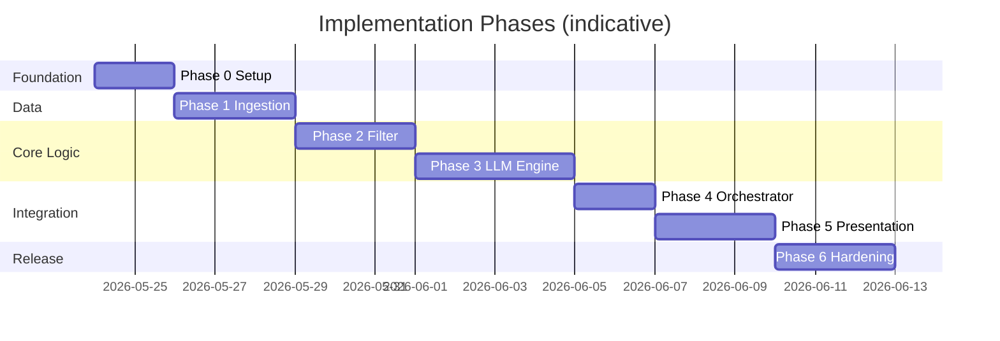
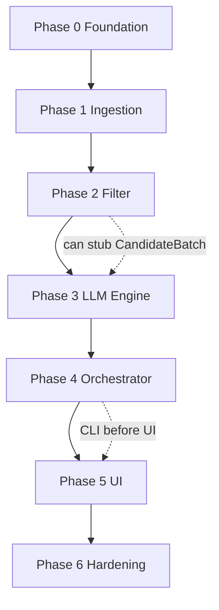

# Phase-Wise Implementation Plan

This document defines a **sequential, phase-by-phase build plan** for the AI-powered restaurant recommendation system. It is derived from:

| Source | Purpose |
|--------|---------|
| [`docs/context.md`](context.md) | Product workflow, success criteria, design principles |
| [`docs/architecture.md`](architecture.md) | Components, contracts, testing, deployment |

**Target outcome:** A working app where users enter preferences, receive **top 5** ranked restaurants from real Hugging Face data, each with structured fields and an LLM explanation.

---

## Plan Overview



| Phase | Name | Maps to context workflow | Architecture refs |
|-------|------|--------------------------|-------------------|
| **0** | Project foundation | — | §10, §9.1 |
| **1** | Data ingestion | Stage 1 | §4.1, §7 |
| **2** | Filter & integration | Stage 3 (partial) | §4.3, §7 |
| **3** | LLM recommendation engine | Stages 3–4 | §4.4–4.6, §8 |
| **4** | Application orchestrator | All stages (wiring) | §4.7, §5 |
| **5** | User input & output display | Stages 2 & 5 | §4.2, §6.3 |
| **6** | Hardening, test & deploy | Success criteria | §9, §11, §12 |

**Estimated total:** ~20 working days (adjust for team size and familiarity).

**Recommended stack (architecture default):** Python 3.11+, `datasets`, `pandas`, Streamlit, **Groq** (`groq` SDK) for Phase 3 LLM.

---

## Phase 0: Project Foundation

**Goal:** Runnable repo skeleton, configuration, and shared data contracts—no business logic yet.

### Tasks

| # | Task | Owner hint |
|---|------|------------|
| 0.1 | Initialize repo layout per architecture §10 | Dev |
| 0.2 | Add `requirements.txt` (`datasets`, `pandas`, `pydantic`, `python-dotenv`, `streamlit`, `groq`) | Dev |
| 0.3 | Create `.env.example` with `HF_DATASET_ID`, `LLM_PROVIDER=groq`, `LLM_MODEL`, `GROQ_API_KEY`, `MAX_CANDIDATES`, `DEFAULT_TOP_N` | Dev |
| 0.4 | Implement `config/settings.py` loading env with sensible defaults | Dev |
| 0.5 | Define `app/models.py`: `Restaurant`, `UserPreferences`, `CandidateBatch`, `RecommendationResult`, `NoResultsResponse` | Dev |
| 0.6 | Add `README.md` with setup, env vars, and how to run (placeholder commands) | Dev |
| 0.7 | Configure `tests/` with pytest; add smoke test that imports app | Dev |

### Deliverables

- [ ] Folder structure: `app/`, `config/`, `prompts/`, `tests/`, `docs/`
- [ ] All Pydantic/dataclass models documented with field types
- [ ] `pytest` passes with zero or minimal placeholder tests

### Acceptance criteria

- `python -m app.main` or equivalent entry exists (can print "not implemented")
- Settings load from `.env` without hardcoded secrets
- Models match architecture §4.1, §4.2, §6.3 field names

### Dependencies

- None (first phase)

---

## Phase 1: Data Ingestion (Context Stage 1)

**Goal:** Load Hugging Face dataset, normalize into `Restaurant` records, keep in memory.

**Context alignment:** Ingest real Zomato-style data; extract name, location, cuisine, cost, rating.

**Architecture alignment:** §4.1 Data Ingestion Module, §7 budget thresholds.

### Tasks

| # | Task | Details |
|---|------|---------|
| 1.1 | Implement `app/ingestion/loader.py` | Load `ManikaSaini/zomato-restaurant-recommendation` via `datasets` |
| 1.2 | Inspect raw schema | Document column mapping in code comments or `docs/data-schema.md` |
| 1.3 | Implement `app/ingestion/normalize.py` | Map columns → canonical `Restaurant` |
| 1.4 | Type coercion | `rating` → float; handle missing name/location (drop row) |
| 1.5 | String normalization | Trim, lowercase location/cuisine for matching |
| 1.6 | Budget tier derivation | Compute percentiles; assign `low` / `medium` / `high` to `budget_tier` |
| 1.7 | Stable IDs | Use dataset index or hash as `restaurant.id` |
| 1.8 | In-memory store | Expose `get_all_restaurants() -> list[Restaurant]` or singleton store |
| 1.9 | Startup load | Eager load on app init with retry/backoff on HF failure |
| 1.10 | Unit tests | Normalization, budget buckets, dropped invalid rows |

### Deliverables

- [ ] `loader.py` + `normalize.py` complete
- [ ] Log line: `Loaded N restaurants from Hugging Face`
- [ ] `tests/test_ingestion.py` with fixtures (small CSV/mock if HF slow in CI)

### Acceptance criteria

| Criterion | Verification |
|-----------|--------------|
| Dataset loads from HF URL in context | Manual run + test |
| Each `Restaurant` has `id`, `name`, `location`, `cuisines`, `rating`, `budget_tier` | Unit test asserts |
| Invalid rows excluded | Test with malformed sample |
| Reload not required per request | Store persists for app lifetime |

### Phase exit demo

```bash
# CLI or script prints first 3 normalized restaurants
python -c "from app.ingestion.loader import load_restaurants; print(load_restaurants()[:3])"
```

### Dependencies

- Phase 0 complete

---

## Phase 2: Filter & Integration Layer (Context Stage 3 — Part 1)

**Goal:** Deterministic filtering from full dataset → bounded `CandidateBatch` (no LLM yet).

**Design principle:** Structured filter before LLM (`context.md`).

**Architecture alignment:** §4.3 Filter Service, §7 matching logic, ADR-001.

### Tasks

| # | Task | Details |
|---|------|---------|
| 2.1 | Implement `app/filtering/filter_service.py` | `filter(preferences) -> CandidateBatch` |
| 2.2 | Location rule | Case-insensitive match; optional synonym map (Bengaluru → Bangalore) |
| 2.3 | Cuisine rule | Tag overlap or substring on `cuisines` |
| 2.4 | Min rating rule | `rating >= preferences.min_rating` |
| 2.5 | Budget rule | Match `budget_tier` to user `budget` enum |
| 2.6 | Pre-sort | Sort by `rating` descending |
| 2.7 | Cap candidates | `MAX_CANDIDATES` (default 30) |
| 2.8 | Filter stats | Populate `filter_stats`: count before/after, rules applied |
| 2.9 | Serialization helper | `serialized_for_prompt` compact JSON for Phase 3 |
| 2.10 | Zero-match path | Return empty `candidates` without error |
| 2.11 | Optional relaxation | If 0 matches, relax cuisine OR budget once; record in stats |
| 2.12 | Unit tests | Each rule in isolation; zero results; cap behavior |

### Deliverables

- [ ] `filter_service.py` with documented pipeline order
- [ ] `tests/test_filter.py` covering edge cases

### Acceptance criteria

| Criterion | Verification |
|-----------|--------------|
| LLM never sees full dataset | Code review: only `CandidateBatch.candidates` exported |
| All hard constraints applied before cap | Tests per rule |
| Empty batch when no match | Test + orchestrator-ready response type |
| Candidates ≤ `MAX_CANDIDATES` | Assert in test |

### Phase exit demo

```python
# Given preferences: Bangalore, medium, Italian, min_rating=4.0
# Print len(candidates) and top 3 names by rating
```

### Dependencies

- Phase 1 (restaurant store available)

---

## Phase 3: LLM Recommendation Engine (Context Stages 3–4)

**Goal:** Prompt builder, Groq LLM client, parser—rank top N, explain each, optional summary.

**LLM provider:** Groq (not OpenAI). Use the `groq` package and `GROQ_API_KEY`; default model `llama-3.3-70b-versatile` per architecture §8 and §9.1.

**Context alignment:** Rank, explain, optionally summarize; only filtered candidates.

**Architecture alignment:** §4.4–4.6, §6.2, §8, ADR-003, ADR-006.

### Tasks

| # | Task | Details |
|---|------|---------|
| 3.1 | Create `prompts/v1_rank_and_explain.txt` | System role, anti-hallucination, JSON output instructions |
| 3.2 | Implement `app/llm/prompt_builder.py` | Inject preferences + candidate JSON + `top_n` (default 5) |
| 3.3 | Implement `app/llm/client.py` | Groq adapter (`LLM_PROVIDER=groq`); `complete` / `complete_json`; mock for CI |
| 3.4 | Wire Groq client | `groq` SDK + `GROQ_API_KEY`; low temperature 0.2–0.4; JSON mode / strict JSON prompt where supported |
| 3.5 | Implement `app/llm/parser.py` | Parse → `LLMRecommendationPayload`; validate schema |
| 3.6 | ID validation | Reject/drop `restaurant_id` not in `CandidateBatch` |
| 3.7 | Hydration | Merge LLM ranks with `Restaurant` fields → `RecommendationResult` |
| 3.8 | Retry logic | 1 retry on malformed JSON |
| 3.9 | Fallback path | On LLM failure: filter-order top N + template explanations |
| 3.10 | Prompt snapshot test | Fixed input → stable prompt hash or file snapshot |
| 3.11 | Parser unit tests | Valid JSON, invalid JSON, unknown ids, duplicate ranks |

### Deliverables

- [ ] `prompts/v1_rank_and_explain.txt`
- [ ] `prompt_builder.py`, `client.py`, `parser.py`
- [ ] `tests/test_prompt.py`, `tests/test_parser.py`
- [ ] Mock LLM fixture for CI (no API key required in CI)

### Acceptance criteria

| Criterion | Verification |
|-----------|--------------|
| Output JSON matches §6.2 schema | Parser test |
| Exactly `top_n` recommendations (default 5) | Integration test with mock LLM |
| No hallucinated restaurant IDs | Test injects fake id → dropped |
| Each result has `explanation` | Assert non-empty or template fallback |
| `summary` optional but supported | Mock response includes it |

### Phase exit demo

```python
# filter → build_prompt → mock/real LLM → print RecommendationResult JSON
```

### Dependencies

- Phase 2 (`CandidateBatch` contract)
- `GROQ_API_KEY` in local `.env` for manual testing against Groq

---

## Phase 4: Application Orchestrator (Pipeline Wiring)

**Goal:** Single `recommend(preferences)` entry coordinating all layers.

**Architecture alignment:** §4.7, §5 sequence diagram, §6.1.

### Tasks

| # | Task | Details |
|---|------|---------|
| 4.1 | Implement `app/orchestrator.py` | `recommend(preferences) -> RecommendationResult \| NoResultsResponse` |
| 4.2 | Input validation | Required fields; enum checks for `budget`; `min_rating` range |
| 4.3 | Pipeline sequence | validate → filter → [if empty] no results → prompt → LLM → parse → hydrate |
| 4.4 | Error mapping | Map dataset/LLM errors to user-safe messages (§9.2) |
| 4.5 | Logging | Per-stage latency; filter before/after counts; no API keys in logs |
| 4.6 | Implement `app/main.py` | Thin CLI: argparse for preferences, print JSON or table |
| 4.7 | E2E test | Mock LLM; full pipeline; assert 5 results and schema §6.3 |

### Deliverables

- [ ] `orchestrator.py` + CLI `main.py`
- [ ] `tests/test_e2e.py` with mocked LLM

### Acceptance criteria

| Criterion | Verification |
|-----------|--------------|
| End-to-end CLI run with real HF + real LLM | Manual smoke test |
| Zero candidates skips LLM | E2E test asserts no LLM call |
| Response matches §6.3 final schema | JSON schema assert |
| Trust: all results ⊆ filtered candidates | Test |

### Phase exit demo

```bash
python -m app.main --location Bangalore --budget medium --cuisine Italian --min-rating 4.0
```

### Dependencies

- Phases 1–3 complete

---

## Phase 5: Presentation Layer (Context Stages 2 & 5)

**Goal:** User-friendly UI to collect preferences and display top 5 with explanations.

**Context alignment:** All preference fields + scannable output (name, cuisine, rating, cost, explanation).

**Architecture alignment:** §4.2, RecommendationCard, §6.3.

### Tasks

| # | Task | Details |
|---|------|---------|
| 5.1 | Choose UI | **Streamlit** recommended (architecture §4.2) |
| 5.2 | Implement `app/presentation/ui.py` | **Import bootstrap:** prepend repo root to `sys.path` before `from app...` (see architecture §4.2.1). Preference form: **location dropdown** from dataset localities/areas, budget, cuisine, min rating, extras |
| 5.3 | Wire orchestrator | On submit → `recommend()` → display results |
| 5.4 | Result cards | Rank, name, cuisine, rating, estimated cost, explanation |
| 5.5 | Session summary | Show optional LLM `summary` above cards |
| 5.6 | Loading & errors | Spinner during LLM; friendly messages for no match / API errors |
| 5.7 | Meta display | Optional: "Considered N candidates" from `meta` |
| 5.8 | Update README | Run from repo root with `PYTHONPATH=.`; `streamlit run app/presentation/ui.py` (architecture §4.2.1, §11.1) |

### Deliverables

- [ ] Working Streamlit app
- [ ] Screenshots or short GIF in README (optional)

### Acceptance criteria

| Criterion | Verification |
|-----------|--------------|
| User can enter all preference types from context | UI walkthrough |
| Top 5 displayed with all required fields | Visual check |
| Additional preferences passed to LLM prompt | Inspect prompt or test |
| No match shows helpful message, not stack trace | Test empty filter |
| Streamlit starts without `ModuleNotFoundError: app` | `python -c "import app"` from repo root; UI loads |

### Phase exit demo

Run from the **repository root** so `app` and `config` resolve:

```bash
# macOS / Linux
cd zomato-top-5
export PYTHONPATH=.
streamlit run app/presentation/ui.py
```

```powershell
# Windows (PowerShell)
cd "d:\Zomato-Top 5"
$env:PYTHONPATH="."
.\.venv\Scripts\streamlit.exe run app\presentation\ui.py
```

Verify imports before launch:

```bash
python -c "import app; print('app import ok')"
```

### Dependencies

- Phase 4 (orchestrator callable)

---

## Phase 6: Hardening, Testing & Deployment

**Goal:** Production-ready quality for demo/submission; meets all success criteria in `context.md`.

**Architecture alignment:** §9 cross-cutting, §11 deployment, §12 NFRs, §13 security.

### Tasks

| # | Task | Details |
|---|------|---------|
| 6.1 | Test coverage pass | Ingestion, filter, prompt, parser, E2E per §9.4 |
| 6.2 | Input sanitization | Strip/limit `additional_preferences` for prompt injection |
| 6.3 | Config review | All magic numbers in settings; document in README |
| 6.4 | Fallback verification | Unset `GROQ_API_KEY` → app still returns filter-based top 5 |
| 6.5 | Performance check | Target &lt; 10s end-to-end (§12); log slow stages |
| 6.6 | `.gitignore` | `.env`, `__pycache__`, `.pytest_cache`, HF cache if local |
| 6.7 | Optional Docker | `Dockerfile` for reproducible deploy |
| 6.8 | Optional Streamlit Cloud | `requirements.txt` pinned; deploy docs |
| 6.9 | Final README | Architecture diagram link, sample input/output |
| 6.10 | Success criteria checklist | Walk through §context success criteria |

### Deliverables

- [ ] Green test suite (`pytest`)
- [ ] README complete
- [ ] Optional: Docker / hosted deploy

### Acceptance criteria (maps to `context.md` success criteria)

| # | Success criterion | How to verify |
|---|-------------------|---------------|
| SC-1 | User enters location, budget, cuisine, min rating, extras | Streamlit form |
| SC-2 | Recommendations from real HF dataset | Spot-check names against dataset |
| SC-3 | Ranked list with structured fields + LLM explanation | UI shows all fields |
| SC-4 | Results respect constraints before ranking | Filter tests + id validation |

### Dependencies

- Phases 0–5 complete

---

## Cross-Phase Dependency Graph



**Parallelization options**

| Parallel track | Requires |
|----------------|----------|
| Prompt template drafting (3.1) during Phase 2 | Context only |
| Streamlit UI mockups (5.x layout) during Phase 3 | Mock `RecommendationResult` |
| README / docs during any phase | Ongoing |

---

## Milestone Checklist

| Milestone | Phases | Definition of done |
|-----------|--------|-------------------|
| **M1: Data ready** | 0–1 | HF dataset loaded; N restaurants in memory |
| **M2: Smart filter** | 2 | CLI prints filtered candidates for any preferences |
| **M3: AI rankings** | 3 | Mock/real Groq LLM returns ranked JSON with explanations |
| **M4: Full pipeline** | 4 | CLI `recommend()` returns top 5 end-to-end |
| **M5: User-facing app** | 5 | Streamlit demo usable by non-developer |
| **M6: Release ready** | 6 | Tests green; success criteria signed off |

---

## Risk Register

| Risk | Impact | Mitigation | Phase |
|------|--------|------------|-------|
| HF dataset schema differs from assumptions | High | Phase 1.2 inspect-first; flexible column map | 1 |
| HF download slow / blocked in CI | Medium | Mock fixture; cache dataset locally | 1, 6 |
| LLM returns invalid JSON | Medium | Retry + fallback (§4.5) | 3 |
| LLM hallucinates restaurants | High | ID validation; system prompt | 3 |
| Zero filter matches common | Medium | Relaxation rules + clear UX message | 2, 5 |
| Groq rate limits / outages | Medium | `MAX_CANDIDATES=30`; retry + fallback; mock in CI | 3 |
| Prompt injection via free text | Low | Sanitize `additional_preferences` | 6 |

---

## Testing Matrix by Phase

| Phase | Unit | Integration | Manual |
|-------|------|-------------|--------|
| 0 | Import smoke | — | Run pytest |
| 1 | normalize, budget | load HF | Print sample rows |
| 2 | each filter rule | filter pipeline | CLI filter demo |
| 3 | prompt snapshot, parser | mock LLM round-trip | Real Groq API call |
| 4 | validation | E2E mock LLM | CLI full run |
| 5 | — | form → orchestrator | Streamlit walkthrough |
| 6 | full suite | fallback path | Deploy smoke |

---

## Traceability Matrix

| Context workflow stage | Implementation phase(s) | Architecture section |
|------------------------|-------------------------|----------------------|
| Stage 1: Data Ingestion | Phase 1 | §4.1 |
| Stage 2: User Input | Phase 5 | §4.2, §4.2.1 |
| Stage 3: Integration Layer | Phase 2, 3 (prompt) | §4.3, §4.4 |
| Stage 4: Recommendation Engine | Phase 3 (Groq) | §4.5, §8, ADR-006 |
| Stage 5: Output Display | Phase 5 | §4.2, §4.2.1, §6.3 |
| Design: Structured + LLM | Phase 2 → 3 order | §2, ADR-001 |
| Success criteria | Phase 6 checklist | §15 |
| Top 5 default | Phases 3–5 (`DEFAULT_TOP_N=5`) | ADR-002 |

---

## Suggested Sprint Breakdown (2-week sprints)

### Sprint 1 (Days 1–5)

- Phase 0 (Days 1–2)
- Phase 1 (Days 3–5)
- **Milestone M1**

### Sprint 2 (Days 6–10)

- Phase 2 (Days 6–8)
- Phase 3 start (Days 9–10): prompt + client
- **Milestone M2**

### Sprint 3 (Days 11–15)

- Phase 3 finish (Days 11–12)
- Phase 4 (Days 13–14)
- Phase 5 start (Day 15)
- **Milestones M3, M4**

### Sprint 4 (Days 16–20)

- Phase 5 finish (Days 16–17)
- Phase 6 (Days 18–20)
- **Milestones M5, M6**

---

## Definition of Done (Project Level)

The project is **complete** when:

1. All six phases’ acceptance criteria are checked off
2. `pytest` passes locally and in CI (if configured)
3. Streamlit app runs with HF dataset + `GROQ_API_KEY`
4. User receives **5** recommendations with name, cuisine, rating, cost, and explanation
5. Documentation set is consistent: `context.md` → `architecture.md` → this plan → `README.md`

---

**Document version:** 1.0  
**Derived from:** [`docs/context.md`](context.md), [`docs/architecture.md`](architecture.md)
